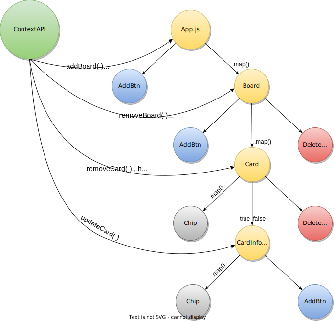

> 15 - July - 2022
## Kanban Board | [Live Link](https://kanban-bd.netlify.app)

# React + Tailwind

## Yarn base packages...
|No| Package Installs               | Use for                       |
|--|--------------------------------|-------------------------------|
| 1| `yarn add` react-feather       | [Feather icons at UI][link]   |
| 2| `yarn add` react-confirm-alert | Confirm Dialog Box            |

[link]: https://feathericons.com


## Learning context by developing this application:
|No| Context learn by building this project... | 
|--|-------------------------------------------|
| 1| Project Structure                         | 
| 2| Full Mobile Responsiveness                | 
| 3| Input `autoFocus` attribute               | 
| 4| Custom scroll bar styling in Tailwind     | 
| 5| Component dynamic css styling passing     |
| 6| Drag & Drop working functionality         |
| 7| `draggable` + `onDragEnter` + `onDragEnd` attribute's  |
| 8| Confirm Dialog Box with customization UI               |
| 9| `Esc` Key press Event Listener For Closing Modal       |
|10| data set + get form localStorage + live data update    |
|11| input `onSubmit` props sent + dynamically value send into context api |


## Project Structure
```jsx
    ├───public
    │   ├───index.html
    │   ├───kanban.ico
    │   └───readme.png
    │
    ├───src
    │   ├───components
    │   │   ├───AddBtn.jsx
    │   │   ├───Board.jsx
    │   │   ├───Card.jsx
    │   │   ├───CardInfoModal.jsx
    │   │   ├───Chip.jsx
    │   │   ├───DeleteDropDown.jsx
    │   │   └───index.js
    │   │
    │   ├───style
    │   │   └───index.css
    │   │
    │   ├───App.js
    │   └───index.js
    │   
    ├───.gitignore
    ├───package.json
    ├───postcss.config.js
    ├───README.md
    ├───tailwind.config.js
    └───yarn.lock
```


## Components Relationship, inside component tree...
<p align="center"> 
  
</p>


## Project Data Structure
```
Board = [
    {}, ****************** 1.1
    {}, ****************** 1.2
]

===============================================

Board = [
    {
        id : '101',
        title : 'Board Title',
        cards : [
            {}, ****************** 2.1
            {}, ****************** 2.2
        ]
    },
    {}, ****************** 1.2
]

===============================================

BoardList = [
    {
        id : '101',
        title : 'BoardList Title',
        cards : [
            {
                id : '202',
                title : 'Card Title',
                tags : [
                    {
                        text : Frontend,
                        color : 'green',
                    },
                ],
                tasks : [
                    {
                        id : '303',
                        title : 'Title - 1',
                    },
                ],
                desc : 'Add any descriptions',
                date : new Date(),
            },
            {}, ****************** 2.2
        ]
    },
    {}, ****************** 1.2
]
```